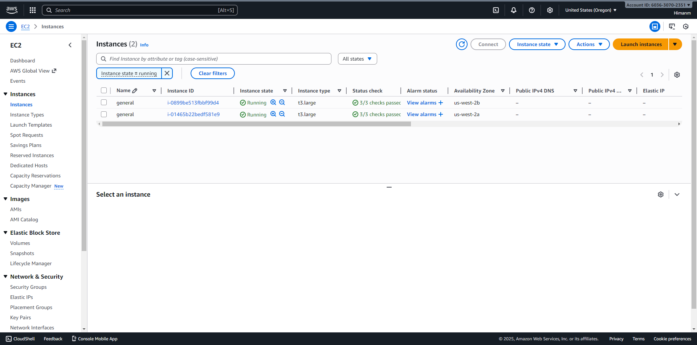
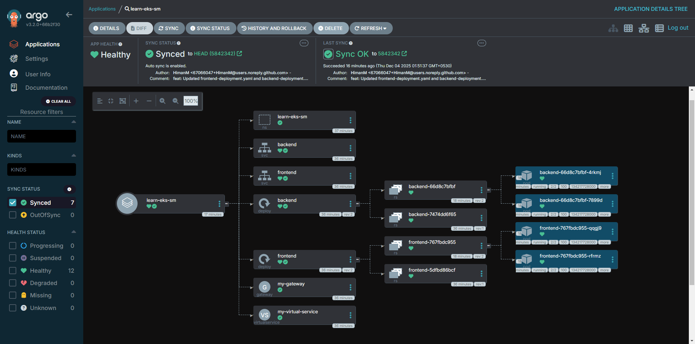
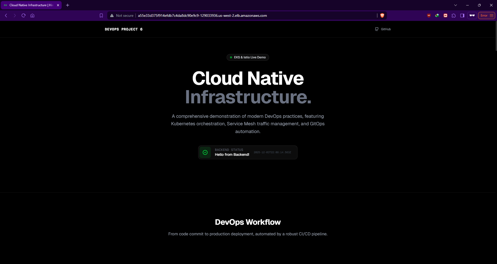
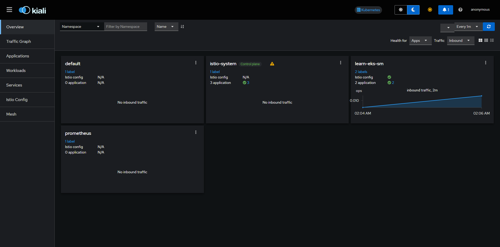

# DevOps Project 6: Learning EKS, Istio, Kiali, and ArgoCD

This project is a comprehensive hands-on exploration of **Amazon EKS**, **Istio Service Mesh**, **Kiali**, and **ArgoCD**. It demonstrates Infrastructure as Code (IaC) with Terraform, GitOps with ArgoCD, and advanced observability.

## 🚀 Project Overview

The goal is to master modern cloud-native technologies:
- **Infrastructure as Code**: Provisioning EKS and VPC with Terraform.
- **GitOps**: Managing application deployments using ArgoCD.
- **Service Mesh**: Traffic management and security with Istio.
- **Observability**: Visualizing the mesh with Kiali.

### Architecture
- **Cloud**: AWS (EKS v1.33)
- **IaC**: Terraform
- **GitOps**: ArgoCD
- **Mesh**: Istio (v1.24.0)
- **Observability**: Kiali, Prometheus


## 📂 Repository Structure

- `terraform/`: Infrastructure definitions.
- `manifests/`: Kubernetes YAMLs (Deployment, Service, Istio Gateway).
- `.github/workflows/`: CI/CD for Docker builds.
- `.docs/`: Project screenshots.

## 🛠️ Prerequisites

- AWS CLI, Terraform, Docker, kubectl, ArgoCD CLI.

## 📝 Setup & Deployment Guide

### 1. Infrastructure Provisioning (Terraform)

Initialize and apply the Terraform configuration to create the VPC and EKS cluster.

```bash
cd terraform
terraform init
terraform apply --auto-approve
```

**Terraform Output:**


**AWS Console - EKS Cluster:**


**AWS Console - EC2 Nodes:**


**AWS Console - Networking:**


**AWS Console - Security Groups:**


**AWS Console - Auto Scaling Groups:**


### 2. CI/CD Pipeline

GitHub Actions automatically builds and pushes Docker images to the registry.


### 3. GitOps with ArgoCD

We use ArgoCD for continuous delivery. First, the EKS cluster was added to the ArgoCD instance:

```bash
argocd cluster add arn:aws:eks:us-west-2:603630702351:cluster/learn-eks-sm-cluster
```

**ArgoCD Applications Overview:**


**Application Details:**


**Sync Status:**


### 4. Application Access (Istio Ingress)

The application is exposed via an AWS Application Load Balancer (ALB) provisioned by the Istio Ingress Gateway.

**AWS Console - Load Balancer:**


**AWS Console - Target Groups:**


**Live Application:**


### 5. Observability (Kiali)

Kiali visualizes the service mesh, showing traffic flow and health.

**Kiali Mesh Graph:**


**Kiali Overview:**


## 🧹 Cleanup

```bash
cd terraform
terraform destroy --auto-approve
```
